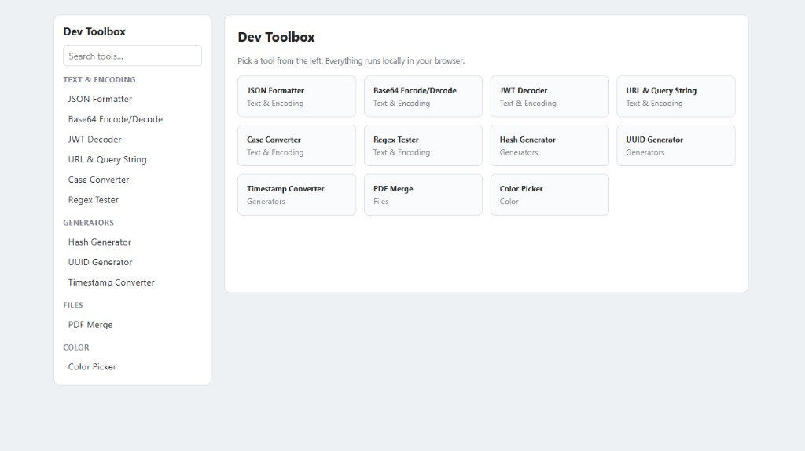
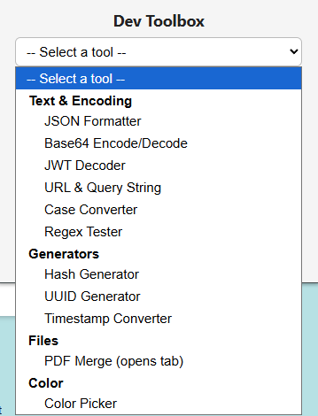

# Dev Toolbox

A Manifest V3 Chrome extension bundling eleven developer utilities — including a PDF merger that handles permission-restricted files.

Everything runs locally in your browser. The extension declares **no permissions**, makes no network requests, and no file or pasted value ever leaves your machine.



## Tools

| Tool | What it does |
| --- | --- |
| JSON Formatter | Format, minify, and sort keys; reports the line and column on a parse error |
| Base64 | Encode/decode text (UTF-8 safe) or encode a file |
| JWT Decoder | Decodes header and payload, resolves `exp`/`iat`/`nbf` to local time and flags expiry |
| URL & Query String | Percent-encode/decode, plus an editable table of query parameters |
| Case Converter | camel, Pascal, snake, SCREAMING_SNAKE, kebab, dot, Title, sentence |
| Regex Tester | Live match highlighting with numbered and named capture groups |
| Hash Generator | SHA-1/256/384/512 over text or a file, via `crypto.subtle` |
| UUID Generator | Bulk UUID v4 and NanoID-style short IDs |
| Timestamp Converter | Epoch seconds/milliseconds to ISO, local, and relative time, and back |
| PDF Merge | Combine PDFs in any order, with optional per-file page ranges |
| Color Picker | Pick a colour from the page with the EyeDropper API; copy HEX or RGB |

## Installing

```bash
git clone https://github.com/bryl-dev/develeperToolsExtension.git
cd develeperToolsExtension
npm install
npm run build
```

Then open `chrome://extensions`, turn on **Developer mode**, choose **Load unpacked**, and select the repository folder.

The bundled output is committed, so a fresh clone will load without building. You only need `npm run build` after changing anything under `src/`.

## Two surfaces

Most tools open directly in the toolbar popup. PDF Merge instead opens a full browser tab, because a 360px popup dismisses itself the moment the OS file picker takes focus — which would discard your selected files mid-merge. The popup hands off to the full page via `chrome.tabs.create`, and the same tool registry drives both surfaces.



The popup's picker is grouped by category and labels PDF Merge as opening a tab, so the hand-off is never a surprise.

## PDF merging

Merging is powered by [`pdf-lib`](https://github.com/Hopding/pdf-lib): each source page is deep-copied with `copyPages` so fonts, images, and annotations survive, then appended in the order shown in the file list.

Files can be reordered, and each accepts an optional page range such as `1-3,5` or the open-ended `3-`. An out-of-range value is flagged inline and blocks the merge rather than silently falling back to all pages.

### Encrypted PDFs

Many institutional PDFs — transcripts, statements, invoices — are encrypted purely to restrict copying and printing, even though they open without prompting for a password. `pdf-lib` can parse these but never decrypts them, so naively copying their pages produces a document whose pages render completely blank.

This extension implements the PDF *standard security handler* directly, in [`src/tools/pdfCrypto.ts`](src/tools/pdfCrypto.ts) and [`src/tools/pdfDecrypt.ts`](src/tools/pdfDecrypt.ts). Files are decrypted on load, so restricted PDFs merge with their content intact and are marked "restricted, unlocked" in the file list.

Supported: revisions 2–6, covering RC4 40/128-bit, AES-128 (AESV2), and AES-256 (AESV3), for documents whose user password is empty. A PDF that genuinely requires a password is reported as such instead of silently producing blank pages.

Note that the merged output no longer carries the original's permission flags. Use this on documents you own.

## Development

```bash
npm run build      # bundle once
npm run dev        # rebuild on change
npm run typecheck  # tsc --noEmit
```

`build.js` runs esbuild over two entry points, emitting ES modules beside the HTML that loads them. Code splitting keeps `pdf-lib` in its own chunk that loads only when the PDF tool is opened, which keeps the popup bundle at a couple of kilobytes instead of ~840 KB.

### Layout

```
manifest.json           MV3 manifest (no permissions)
build.js                esbuild config
src/
  popup/                Toolbar popup surface
  pages/                Full-tab toolbox surface
  tools/                One module per tool
    registry.ts         Single source of truth for the tool list
    pdfCrypto.ts        MD5, RC4, AES helpers and key derivation
    pdfDecrypt.ts       Applies decryption across a document
  ui/kit.ts             Shared DOM helpers
```

### Adding a tool

Write a module exporting a `() => HTMLElement` factory, then add one entry to `TOOLS` in [`src/tools/registry.ts`](src/tools/registry.ts). Both surfaces pick it up automatically. Set `surface: "page"` for anything that needs more room than the popup allows; `mount` may be async if the tool should be code-split.

## License

ISC.
